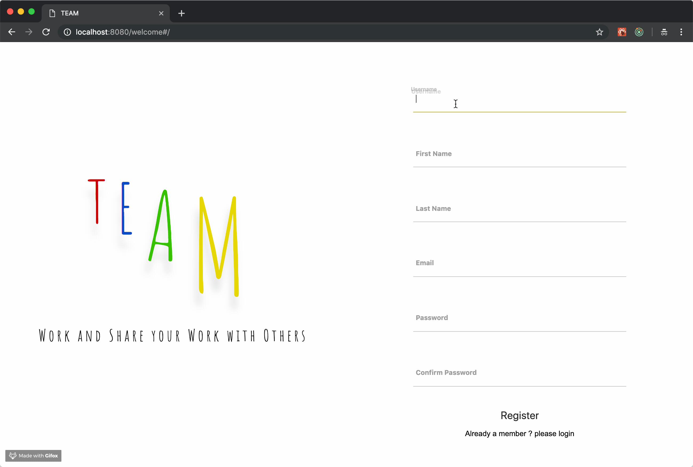
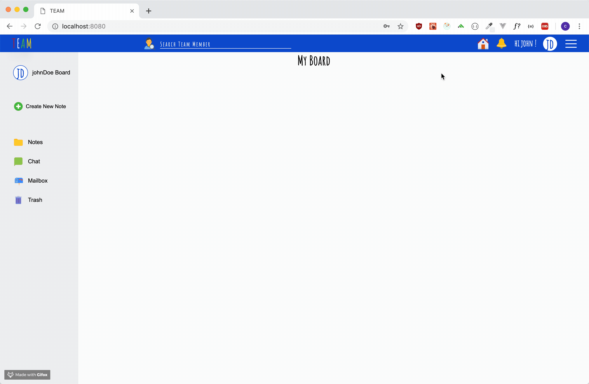
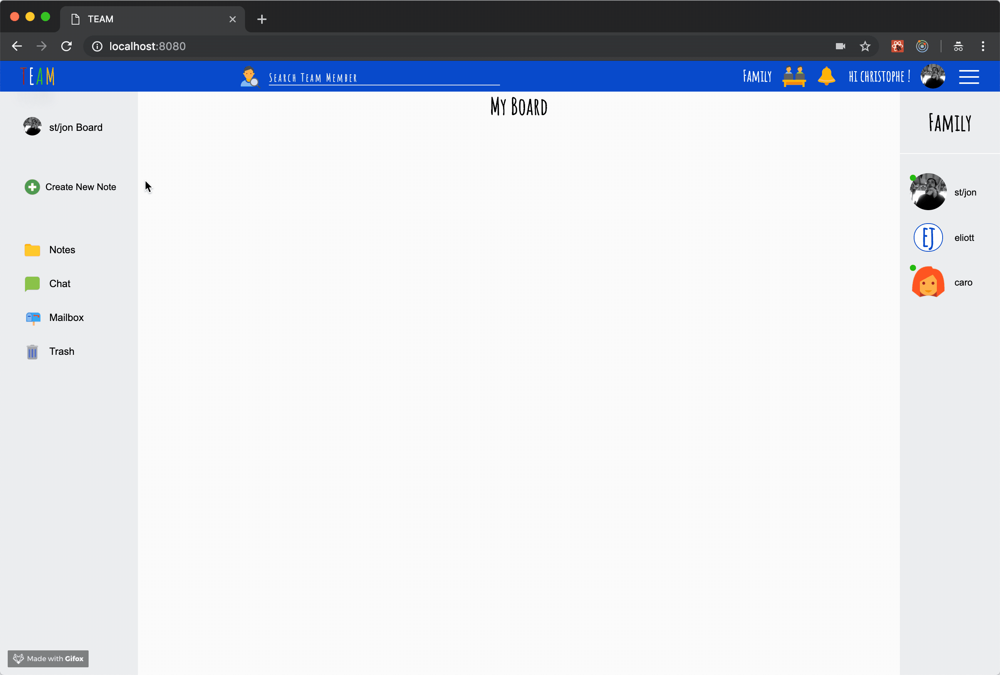
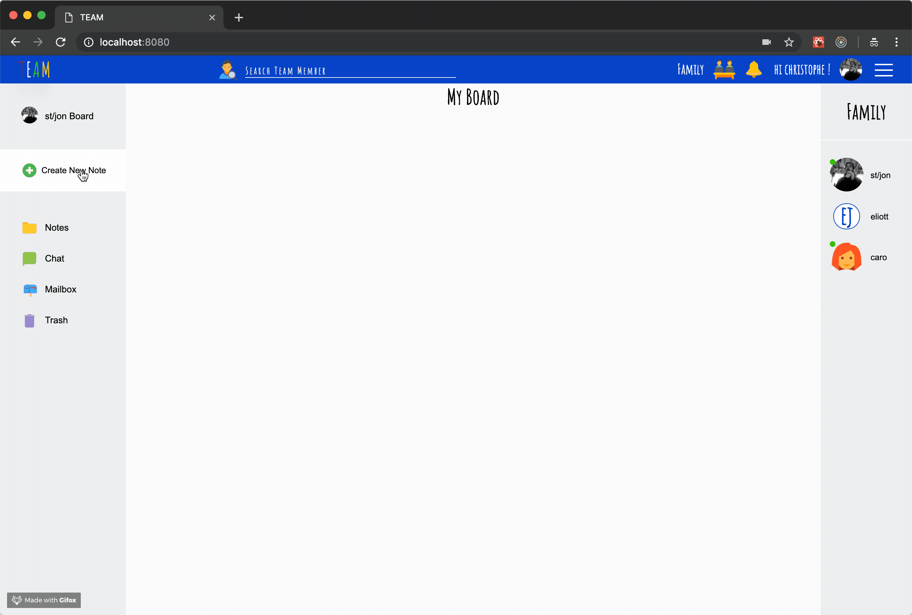
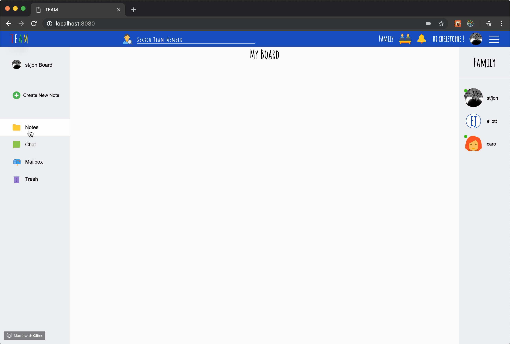
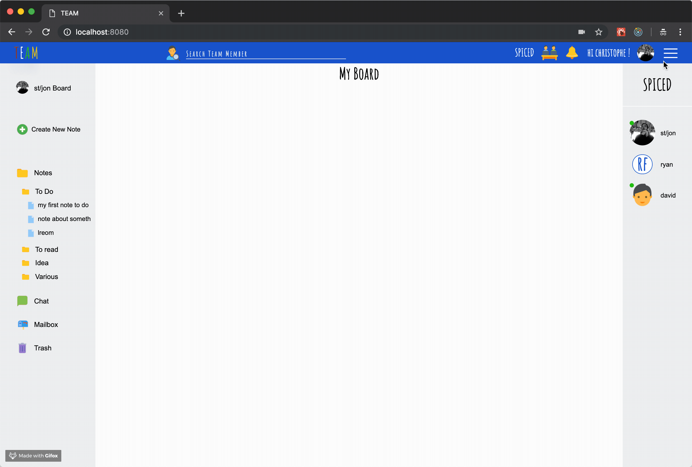
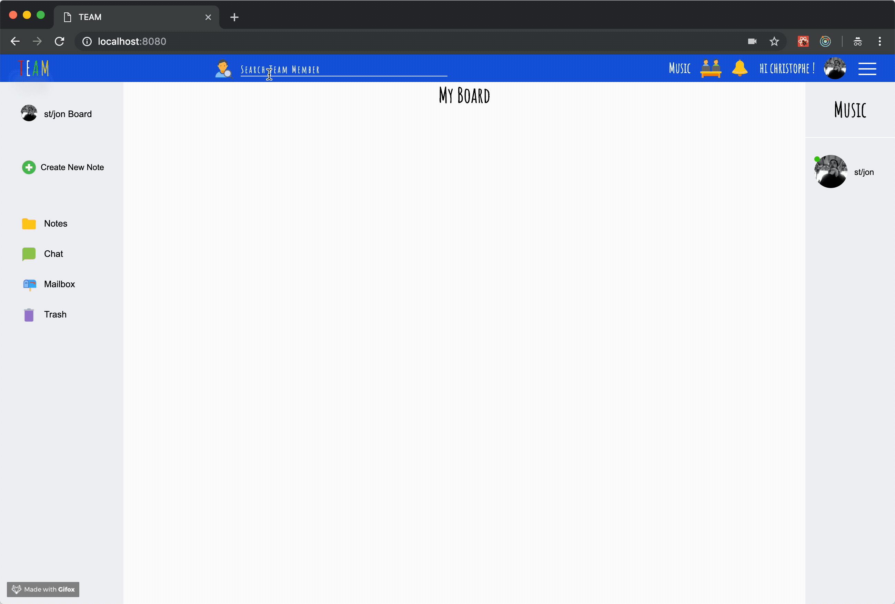
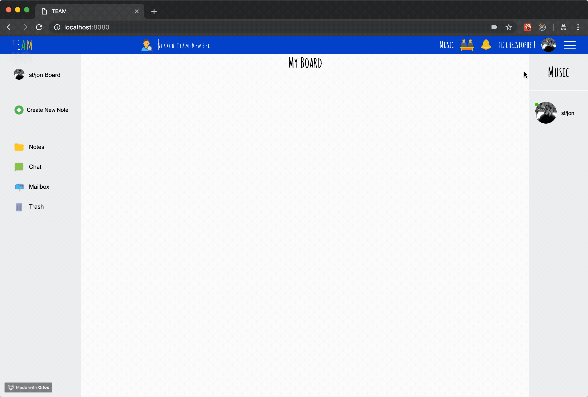
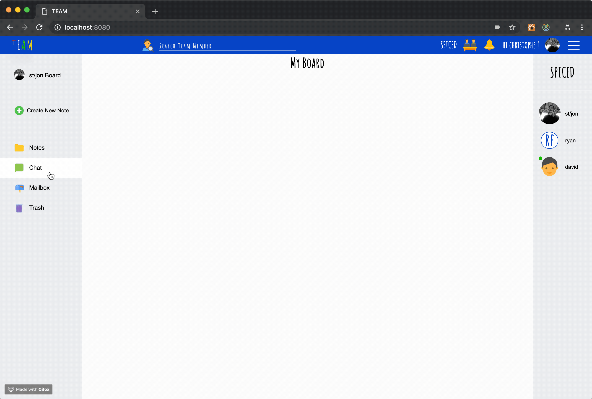
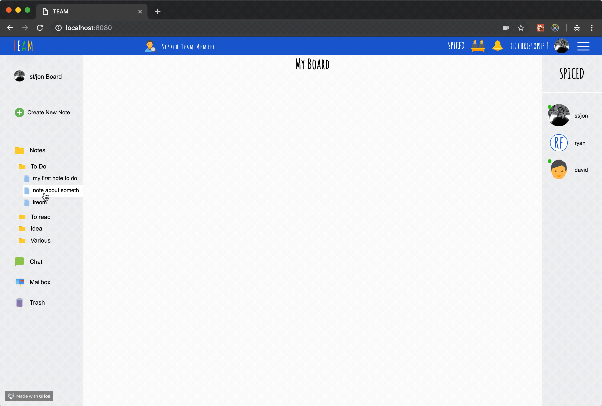

# Team App

This project has been made in one week. This is a note taking app that allows the user to create or join a team of people and share his ideas and his notes with them. more details in the getting started part =>



## Getting Started

You'll have first to register or login yourself on the website, there is normal error handling, every input are needed, username should be unique, email should be a real one, password should be at least 8 character, including at least one number, one uppercase letter and no space.

Once on your page you ll be able to add a profile picture, or simply choose your gender. If nothing is submited, your initial will be used in place, if you only give your gender, the default profile picture will change depending on your infos (you also can ignore this or declare yourself intersex).



You can then start using the website and create your first note by clicking "create new notes" in the user toolbar on the left side of the screen. 
There is 4 differents kind of notes:  text (with or whitout picture), link, sound and video.
The user need to give each note a title and choose the folder the note will be stored to.
By default 4 folders has been created (to do, to read, ideas, various), but you can create your own by simply name it in the create note widget.





You can then navigate to your folders, and show the notes on your board by clicking on them.



Now it's time to get social... You can create your first team by clicking the menu button on the top right of the screen and then choose "create a team". This will open a modal where you can give your team a name. You can then navigate between all your teams - or your homepage - by clicking the icon in the header bar next to the bell. The home icon indicate that you are in your private space. if the user click on it he can then choose between all of his teams.



You'll automaticaly become the administrator of the team, and you will be the only one able to invite people to join the team.
for that, use the searchbar, you can search people by username, first name or last name.
By clicking on one, you'll be redirected to his presentation page, here you can invite him to join your team.



In the menu  you can then navigate to 'teams and members', this page let you manage your teams and your requests. If you are the administrator of the team (a little admin icon will appear next to the team name), you will be able to cancel a request you did previously if the user hasn't answered yet, but you are also able to end the membership of another user.
if you're not the administrator of the team, you will only be able to accept the invitation or leave the team.
The 'status button' is also responsive to the member infos, the icon will change depending on your gender.



When your team is all setup, you can have access to the chat, this is a private chat, only the accepted members of the team can have access to. the members online are marked with a little green dot next to their profile picture.



One of the nicest feature of this website, is the possibility to send one of your note to another member of your team. If you really like one of your idea, or did a long speech in front of your camera explaining stuffs. You can then click on the mailbox icon on the top left of the notes, choose the member you want to send it to, select in which team this member is and send the note.
Your note will automatically be sent to the member mailbox in his user tool bar and stored in a folder with the name of the team.
Each received notes have a title including the name of the sender and the title of the note.




### Installing

to install the application on your local machine simply clone the repository to your local machine. 
create a new database and use the files from the SQL folder to create the tables.
Go to the root of your folder

```
npm install
```

open a new tab in your terminal 

```
node bundle.server.js
```

then to start the server

```
npm start
```

## Built With

* Node.js
* Express
* socketIO
* multer
* knox
* react-mic
* cheerio
* JavaScript
* PostgreSQL
* CSS
* HTML


## Authors

* **Christophe Johanny** - *Initial work* - [st-jon](https://github.com/st-jon)


## License

This project is licensed under the MIT License - see the [LICENSE.md](LICENSE.md) file for details
